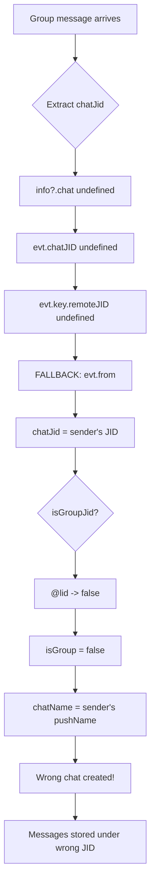

# BUG: Group chat messages stored with wrong JID and sender's name

**Status: OPEN**

## Symptom

When messages arrive from group chats, the `list_chats` output shows incorrect chat names:

| What User Sees | Expected Behavior |
|---------------|-------------------|
| JID `138053771370743@lid` displays name "Benjamin Alloul" | Should display group name "Kapso Sandbox" (it's a group) |
| JID `14384083030@s.whatsapp.net` shows just the phone number | Should show contact name "Benjamin Alloul" |
| Messages meant for groups appear under personal chats | Group messages should appear under the group chat |

**Observed behavior from `list_chats` output:**

```
[Chat] Benjamin Alloul
     Last: 2026-04-04, 21:15:24: Hello mcp
     JID: 138053771370743@lid

[Chat] 14384083030@s.whatsapp.net
     Last: 2026-04-04, 21:14:03
     JID: 14384083030@s.whatsapp.net

[Group] WhatsAppMCP
     Last: never
     JID: 120363425651110648@g.us
```

**Actual reality:**
- `138053771370743@lid` is actually the **group** "Kapso Sandbox" (JID should end in `@g.us`)
- `14384083030@s.whatsapp.net` is **Benjamin Alloul** (a contact, not just a number)
- Message "Hello mcp" was sent to the Kapso Sandbox group, not to a personal chat

## Root Cause

The bug is in `src/whatsapp/client.ts` in the `_persistMessage()` method, specifically in the `chatJid` extraction logic at line 835:

```typescript
chatJid: info?.chat || evt.chatJID || evt.key?.remoteJID || evt.from || null,
```

### The Problem Explained

When a message arrives from a **group chat**, the WhatsApp event structure contains:

| Field | Value | Description |
|-------|-------|-------------|
| `evt.from` | `138053771370743@lid` | The **sender's JID** (group participant) |
| `evt.key.remoteJID` | `120363425651110648@g.us` | The **group JID** |
| `evt.key.participant` | `138053771370743@lid` | The sender's JID (same as `evt.from` for groups) |
| `evt.pushName` | `Benjamin Alloul` | The sender's display name |
| `evt.chatName` | `Kapso Sandbox` | The group name (when available) |

**The fallback chain issue:**

1. For certain message types or event structures, `info?.chat`, `evt.chatJID`, and `evt.key?.remoteJID` may be `undefined`
2. The code falls back to `evt.from` — which is the **sender's JID**, not the group JID
3. The message gets stored with `chatJid = sender's JID` instead of `chatJid = group JID`
4. Since `@lid` is not `@g.us`, `isGroupJid(chatJid)` returns `false`
5. The sender's `pushName` ("Benjamin Alloul") gets stored as the chat name for the wrong JID

### Affected Code Flow



### Relevant Code Locations

1. **`src/whatsapp/client.ts:835`** — chatJid extraction:
   ```typescript
   chatJid: info?.chat || evt.chatJID || evt.key?.remoteJID || evt.from || null,
   ```

2. **`src/whatsapp/client.ts:867-871`** — chat name logic:
   ```typescript
   const isGroup = isGroupJid(msg.chatJid);
   // For groups, only use evt.chatName (the actual group name).
   // evt.pushName / info?.pushName is the *sender's* display name — using it for
   // group chats would overwrite the group name with the sender's name (Bug fix).
   const chatName = evt.chatName || (!isGroup ? (evt.pushName || info?.pushName) : null) || null;
   ```

3. **`src/whatsapp/client.ts:548-553`** — history sync also sets names:
   ```typescript
   const name = conv.displayName || conv.name || null;
   const isGroup = typeof chatJid === 'string' && chatJid.endsWith('@g.us');
   if (name) {
     this.messageStore.upsertChat(chatJid, name, isGroup, null, null);
   }
   ```

4. **`src/whatsapp/store.ts:864`** — updateChatName allows overwrite:
   ```typescript
   .prepare('UPDATE chats SET name = ? WHERE jid = ? AND (name IS NULL OR name = jid OR is_group = 1)')
   ```

## Fix Strategy

### Option 1: Fix chatJid extraction priority (Recommended)

Modify the `chatJid` extraction to handle group participant context:

```typescript
// src/whatsapp/client.ts - _persistMessage() method
const chatJid = 
  info?.chat || 
  evt.chatJID || 
  evt.key?.remoteJID ||
  // CRITICAL: For group messages, key.participant indicates sender,
  // and we MUST use key.remoteJID (group JID) instead of evt.from (sender JID)
  (evt.key?.participant && evt.key?.remoteJID 
    ? null // Don't fall through to evt.from for group participant messages
    : null) ||
  evt.from ||
  null;
```

### Option 2: Add explicit group context check

```typescript
// Check if this is a group participant message
const participantJid = evt.key?.participant || null;
const groupJid = (participantJid && evt.key?.remoteJID) 
  ? evt.key.remoteJID  // Group message: use remoteJID
  : null;

const chatJid = 
  info?.chat || 
  evt.chatJID || 
  groupJid ||  // Use group JID for participant messages
  evt.key?.remoteJID || 
  evt.from || 
  null;
```

## Debug Steps

1. **Enable DEBUG logging:**
   ```bash
   DEBUG=client npm start
   ```

2. **Add detailed event logging in `_persistMessage()`:**
   ```typescript
   // src/whatsapp/client.ts - _persistMessage() method
   console.error('[WA DEBUG] Message event structure:', {
     from: evt.from,
     chatJID: evt.chatJID,
     keyRemoteJID: evt.key?.remoteJID,
     keyParticipant: evt.key?.participant,
     pushName: evt.pushName,
     chatName: evt.chatName,
     infoChat: info?.chat,
     infoSender: info?.sender
   });
   ```

3. **Receive messages in groups and compare structures**

4. **Verify which field always contains the correct group JID**

## Related Issues

- **BUG-self-account-messages-not-received.md** — Related message handling issue
- **Empty messages bug** — May share root cause in `_persistMessage()`

## Files to Modify

| File | Changes |
|------|---------|
| `src/whatsapp/client.ts` | Fix `chatJid` extraction in `_persistMessage()` |
| `src/whatsapp/store.ts` | Optional: Add `repairChatNames()` migration |
| `src/tools/chats.ts` | Optional: Add `fix_chat_names` tool |

## Database Repair (Post-Fix)

After fixing the code, existing chats may need repair:

```sql
-- Identify chats with wrong is_group flag
SELECT jid, name, is_group FROM chats 
WHERE (jid LIKE '%@g.us' AND is_group = 0)
   OR (jid LIKE '%@lid' AND is_group = 1);

-- Fix is_group flag based on JID suffix
UPDATE chats SET is_group = 1 WHERE jid LIKE '%@g.us' AND is_group = 0;
UPDATE chats SET is_group = 0 WHERE jid NOT LIKE '%@g.us' AND is_group = 1;
```

For incorrectly cached names, a full re-sync from WhatsApp may be needed.

## Priority

**High** — This bug causes:
1. Messages to appear in wrong chats
2. Group messages being lost (stored under sender's JID instead of group)
3. Confusing UX where contacts show wrong names
4. Potentially missed messages when searching by group name