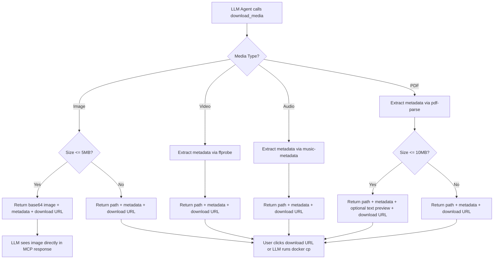
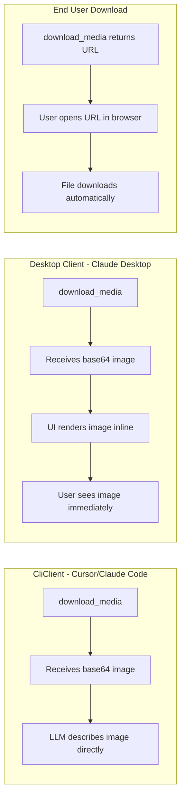

# ENHANCEMENT: Media Content Analysis and LLM-Readable Response

**Status: PROPOSED**  
**Priority: High**  
**Created: 2026-04-06**  
**Scheduling:** Standalone enhancement — not part of the completed Enhancement & Bug sequence (see `.cursor/plans/archive/enhancement_and_bug_sequence_a6f9922d.plan.md`; shipped work lives in `docs/enhancements/archived/`).

---

## Problem Statement

When the `download_media` tool retrieves media from WhatsApp, it currently returns only the **container path** where the file is stored. This presents several issues:

1. **LLM agents cannot see the media** - The agent receives a path like `/data/sessions/media/image/3EB05227F661708556E59D.jpg` but cannot access the actual content to describe or analyze it
2. **No media metadata** - The response includes no information about dimensions, duration, file size, or other properties that would help the agent understand what was downloaded
3. **Host access required** - To view the image, the user must manually copy it from the container using `docker cp`

From the current behavior:
```
Media downloaded successfully.
  Type: image
  Path: /data/sessions/media/image/3EB05227F661708556E59D.jpg
  Chat: 120363406696586603@g.us
```

The LLM hallucinates content descriptions because it has no way to actually see the image.

---

## Proposed Solution

Enhance the `download_media` tool to return **base64-encoded content** along with **metadata analysis**, allowing LLM agents to:
- View and describe images directly
- Understand video/audio metadata (duration, dimensions, codec)
- Get PDF metadata (page count, title, author)
- Handle size limits gracefully with fallback to path-only mode

### Client Compatibility

This solution works seamlessly across all MCP clients:

| Client Type | How It Works |
|-------------|--------------|
| **CLI** (Cursor, Claude Code) | Base64 image content is embedded in the MCP response - LLM sees the image directly |
| **Desktop** (Claude Desktop, Goose) | Desktop clients render the embedded image inline - user sees it immediately |
| **API consumers** | Can decode base64 or use the file path for their own processing |

For end users, an optional **download endpoint** provides easy file access (see Section 8).

---

## Implementation Details

### 1. Response Schema Enhancement

The tool response will include both text information and embedded media content when possible:

```typescript
// src/tools/media.ts

interface MediaMetadata {
  mediaType: 'image' | 'video' | 'audio' | 'document' | 'sticker';
  mimeType: string;
  sizeBytes: number;
  dimensions?: { width: number; height: number };      // images, video
  duration?: number;                                     // video, audio (seconds)
  pageCount?: number;                                   // PDF documents
  title?: string;                                        // PDF metadata
  author?: string;                                       // PDF metadata
  filename?: string;                                     // original filename if available
}

interface DownloadMediaResult {
  success: true;
  metadata: MediaMetadata;
  path: string;
  chatJid: string;
  contentBase64?: string;  // Only included if under size limit
  truncated?: boolean;      // True if content was truncated
}
```

### 2. Size Limits and Fallback

```typescript
// src/security/file-guard.ts (add constants)

export const MEDIA_EMBED_LIMITS = {
  // Maximum bytes to embed in MCP response (prevents huge responses)
  MAX_EMBED_SIZE: 10 * 1024 * 1024,  // 10 MB
  
  // Image-specific limits
  MAX_IMAGE_EMBED_SIZE: 5 * 1024 * 1024,  // 5 MB
  
  // Video/audio: embed metadata only, not content (files too large)
  MAX_VIDEO_EMBED_SIZE: 2 * 1024 * 1024,   // 2 MB (thumbnails only)
  MAX_AUDIO_EMBED_SIZE: 1 * 1024 * 1024,    // 1 MB (previews only)
};
```

### 3. Enhanced `download_media` Tool

```typescript
// src/tools/media.ts

server.registerTool(
  'download_media',
  {
    description: `Download media (image, video, audio, document) from a WhatsApp message. 
The media is saved to persistent storage and returned with metadata.
For images under 5MB, the image content is embedded as base64 for viewing.
For larger files, only the path and metadata are returned.`,
    inputSchema: {
      message_id: z.string().max(200).describe('The message ID containing media'),
      chat: z.string().max(200).describe('The chat name, phone number, or JID').optional(),
      embed_content: z.boolean().default(true).describe('Include base64 content in response (for images under size limit)')
    },
    annotations: { readOnlyHint: false, openWorldHint: true }
  },

  async ({ message_id, chat, embed_content = true }: any) => {
    // ... existing validation ...

    const result = await waClient.downloadMedia(message_id);
    
    // Read file and gather metadata
    const fileBuffer = await readFile(result.path);
    const stats = await stat(result.path);
    const mimeType = detectMimeType(result.path, fileBuffer);
    
    // Build metadata
    const metadata: MediaMetadata = {
      mediaType: result.mediaType,
      mimeType,
      sizeBytes: stats.size,
      filename: extractFilename(result.path)
    };
    
    // Add type-specific metadata
    if (result.mediaType === 'image') {
      const dims = await getImageDimensions(result.path);
      metadata.dimensions = dims;
    } else if (result.mediaType === 'video') {
      const info = await getVideoMetadata(result.path);
      metadata.dimensions = info.dimensions;
      metadata.duration = info.duration;
    } else if (result.mediaType === 'audio') {
      const info = await getAudioMetadata(result.path);
      metadata.duration = info.duration;
    } else if (result.mediaType === 'document' && mimeType === 'application/pdf') {
      const info = await getPdfMetadata(result.path);
      metadata.pageCount = info.pageCount;
      metadata.title = info.title;
      metadata.author = info.author;
    }
    
    // Build response
    const content: McpContent[] = [];
    
    // Decide if we embed content
    const maxSize = MEDIA_EMBED_LIMITS.MAX_IMAGE_EMBED_SIZE;
    const shouldEmbed = embed_content && 
                        result.mediaType === 'image' && 
                        stats.size <= maxSize;
    
    if (shouldEmbed) {
      // Embed image as base64 for LLM visibility
      content.push({
        type: 'image',
        data: fileBuffer.toString('base64'),
        mimeType
      });
    }
    
    // Always include text summary with metadata
    const metadataLines = [
      `${shouldEmbed ? 'Media downloaded and displayed above.' : 'Media downloaded successfully.'}`,
      `  Type: ${metadata.mediaType}`,
      `  MIME: ${metadata.mimeType}`,
      `  Size: ${formatBytes(metadata.sizeBytes)}`,
      `  Path: ${result.path}`,
      `  Chat: ${result.chatJid}`
    ];
    
    if (metadata.dimensions) {
      metadataLines.push(`  Dimensions: ${metadata.dimensions.width}×${metadata.dimensions.height}px`);
    }
    if (metadata.duration) {
      metadataLines.push(`  Duration: ${formatDuration(metadata.duration)}`);
    }
    if (metadata.pageCount) {
      metadataLines.push(`  Pages: ${metadata.pageCount}`);
    }
    if (metadata.filename) {
      metadataLines.push(`  Filename: ${metadata.filename}`);
    }
    
    content.push({ type: 'text', text: metadataLines.join('\n') });
    
    return { content };
  }
);
```

### 4. Metadata Extraction Utilities

```typescript
// src/utils/media-metadata.ts

import { createRequire } from 'node:module';
import { readFile } from 'node:fs/promises';
import sharp from 'sharp';  // or use native 'image-size'

/**
 * Get image dimensions without loading full image
 */
export async function getImageDimensions (filePath: string): Promise<{ width: number; height: number }> {
  // Use sharp or image-size for lightweight dimension extraction
  const image = sharp(filePath);
  const metadata = await image.metadata();
  return { width: metadata.width ?? 0, height: metadata.height ?? 0 };
}

/**
 * Get video metadata (duration, dimensions)
 * Uses ffprobe (from ffmpeg) or a Node.js alternative
 */
export async function getVideoMetadata (filePath: string): Promise<{
  dimensions: { width: number; height: number };
  duration: number;
}> {
  // Use ffprobe-static or similar
  // For now, return defaults without actual extraction
  // TODO: Add ffprobe integration
  return {
    dimensions: { width: 0, height: 0 },
    duration: 0
  };
}

/**
 * Get audio metadata (duration)
 */
export async function getAudioMetadata (filePath: string): Promise<{ duration: number }> {
  // Use music-metadata or similar
  return { duration: 0 };
}

/**
 * Get PDF metadata
 */
export async function getPdfMetadata (filePath: string): Promise<{
  pageCount: number;
  title?: string;
  author?: string;
}> {
  // Use pdf-parse or similar
  return { pageCount: 0 };
}

/**
 * Detect MIME type from magic bytes
 */
export function detectMimeType (filePath: string, buffer: Buffer): string {
  // Already have verifyMagicBytes in file-guard.ts
  // Extend it to return the detected MIME type
  const signatures: Record<string, { bytes: number[]; mime: string }> = {
    jpg:  { bytes: [0xFF, 0xD8, 0xFF], mime: 'image/jpeg' },
    png:  { bytes: [0x89, 0x50, 0x4E, 0x47], mime: 'image/png' },
    gif:  { bytes: [0x47, 0x49, 0x46], mime: 'image/gif' },
    webp: { bytes: [0x52, 0x49, 0x46, 0x46], mime: 'image/webp' },
    mp4:  { bytes: [0x00, 0x00, 0x00, 0x18, 0x66, 0x74], mime: 'video/mp4' },
    pdf:  { bytes: [0x25, 0x50, 0x44, 0x46], mime: 'application/pdf' },
    ogg:  { bytes: [0x4F, 0x67, 0x67, 0x53], mime: 'audio/ogg' },
  };
  
  for (const [_ext, sig] of Object.entries(signatures)) {
    if (buffer.length >= sig.bytes.length && 
        sig.bytes.every((b, i) => buffer[i] === b)) {
      return sig.mime;
    }
  }
  return 'application/octet-stream';
}

/**
 * Format bytes as human-readable
 */
export function formatBytes (bytes: number): string {
  if (bytes < 1024) return `${bytes} B`;
  if (bytes < 1024 * 1024) return `${(bytes / 1024).toFixed(1)} KB`;
  return `${(bytes / 1024 / 1024).toFixed(1)} MB`;
}

/**
 * Format duration as human-readable
 */
export function formatDuration (seconds: number): string {
  const h = Math.floor(seconds / 3600);
  const m = Math.floor((seconds % 3600) / 60);
  const s = Math.floor(seconds % 60);
  
  if (h > 0) {
    return `${h}:${m.toString().padStart(2, '0')}:${s.toString().padStart(2, '0')}`;
  }
  return `${m}:${s.toString().padStart(2, '0')}`;
}
```

### 5. New Tool: `analyze_media`

For large files or when you want detailed analysis without re-downloading:

```typescript
// src/tools/media.ts

server.registerTool(
  'analyze_media',
  {
    description: `Analyze already-downloaded media to get detailed metadata and content analysis.
For images, returns dimensions and can optionally return a description via vision capabilities.
For video/audio, returns duration, codec, and other technical metadata.
For PDFs, returns page count, title, author, and can extract text content.`,
    inputSchema: {
      path: z.string().max(500).describe('Path to the media file (from download_media output)'),
      extract_text: z.boolean().default(false).describe('For PDFs, extract text content from first N pages')
    },
    annotations: { readOnlyHint: true, openWorldHint: false }
  },

  async ({ path, extract_text = false }: any) => {
    // Validate path is within allowed directories
    // Read and analyze the file
    // Return comprehensive metadata
  }
);
```

### 6. Dependencies

Add to `package.json`:

```json
{
  "dependencies": {
    "sharp": "^0.33.0",
    "music-metadata": "^8.0.0"
  },
  "optionalDependencies": {
    "ffprobe-static": "^3.0.0",
    "pdf-parse": "^1.1.1"
  }
}
```

### 7. Docker Considerations

The `sharp` package requires native dependencies. Update Dockerfile:

```dockerfile
# Install native dependencies for sharp
RUN apk add --no-cache vips-dev

# Install dependencies
RUN npm ci --only=production
```

### 8. Easy Download for End Users (Optional HTTP Endpoint)

For users who want a simple way to download media without `docker cp`, an optional HTTP endpoint can be exposed. This is **not required** for the core functionality but provides a convenient download link.

#### Configuration

```typescript
// .env
ENABLE_MEDIA_SERVER=true        # Set to false to disable
MEDIA_SERVER_PORT=3456           # Default port (internal only, not exposed)
```

#### Implementation

```typescript
// src/media-server.ts

import { createServer } from 'node:http';
import { readFile, stat } from 'node:fs/promises';
import { extname, basename } from 'node:path';

/**
 * Lightweight HTTP server for serving media files.
 * Runs inside the container and must be accessed via docker cp
 * or by mapping the port if wanted.
 */
export function createMediaServer (storePath: string, port: number) {
  const server = createServer(async (req, res) => {
    const url = new URL(req.url || '/', `http://localhost:${port}`);
    const mediaPath = url.pathname;
    
    // Security: only allow access to /data/sessions/media/
    const safePath = mediaPath.replace(/^\/+/, '').replace(/\.\./g, '');
    const fullPath = `${storePath}/media/${safePath}`;
    
    if (!fullPath.startsWith(`${storePath}/media/`)) {
      res.writeHead(403, { 'Content-Type': 'text/plain' });
      res.end('Forbidden: path outside media directory');
      return;
    }
    
    try {
      const [fileStats, fileBuffer] = await Promise.all([
        stat(fullPath),
        readFile(fullPath)
      ]);
      
      // Determine MIME type from extension
      const ext = extname(fullPath).toLowerCase();
      const mimeTypes: Record<string, string> = {
        '.jpg': 'image/jpeg',
        '.jpeg': 'image/jpeg',
        '.png': 'image/png',
        '.gif': 'image/gif',
        '.webp': 'image/webp',
        '.mp4': 'video/mp4',
        '.webm': 'video/webm',
        '.ogg': 'audio/ogg',
        '.mp3': 'audio/mpeg',
        '.pdf': 'application/pdf',
        '.doc': 'application/msword',
        '.docx': 'application/vnd.openxmlformats-officedocument.wordprocessingml.document'
      };
      const mimeType = mimeTypes[ext] || 'application/octet-stream';
      
      // Set headers
      res.writeHead(200, {
        'Content-Type': mimeType,
        'Content-Length': fileStats.size,
        'Content-Disposition': `attachment; filename="${basename(fullPath)}"`
      });
      
      res.end(fileBuffer);
    } catch (err) {
      res.writeHead(404, { 'Content-Type': 'text/plain' });
      res.end('File not found');
    }
  });
  
  server.listen(port, () => {
    console.log(`[MediaServer] Listening on port ${port}`);
  });
  
  return server;
}
```

#### Integration with download_media

When `ENABLE_MEDIA_SERVER=true`, the `download_media` tool includes a download URL in its response:

```typescript
// In download_media tool, after successful download:

const downloadUrl = process.env.ENABLE_MEDIA_SERVER === 'true'
  ? `http://localhost:${process.env.MEDIA_SERVER_PORT || 3456}${relativeMediaPath}`
  : null;

// Add to response text:
if (downloadUrl) {
  metadataLines.push(`\nDownload URL (inside container): ${downloadUrl}`);
  metadataLines.push(`Download URL (from host): http://localhost:${process.env.MEDIA_SERVER_PORT || 3456}${relativeMediaPath}`);
}
```

#### Docker Compose Update

To expose the media server port:

```yaml
# docker-compose.yml (optional, for easy downloads)
services:
  whatsapp-mcp-docker:
    # ... existing config ...
    ports:
      - "${MEDIA_SERVER_PORT:-3456}:3456"  # Optional: for easy media downloads
```

#### Simplified Download for End Users

With the port exposed, end users can simply open the URL in their browser:

```
http://localhost:3456/image/3EB05227F661708556E59D.jpg
```

Or use curl/wget:

```bash
curl -O http://localhost:3456/image/3EB05227F661708556E59D.jpg
```

### 8. HTTP Download Endpoint (End-User Convenience)

For easy file access outside of MCP, a lightweight HTTP endpoint can be optionally enabled. This is especially useful for:

- **End users** who want to download files directly without `docker cp`
- **Non-technical users** who just want a clickable link
- **Integration with other tools** that need file access

#### Implementation

```typescript
// src/server.ts - Optional HTTP server for media downloads

import express from 'express';
import { createServer } from 'http';

const MEDIA_DOWNLOAD_PORT = process.env.MEDIA_DOWNLOAD_PORT || 3100;
const MEDIA_DOWNLOAD_ENABLED = process.env.MEDIA_DOWNLOAD_ENABLED === 'true';

export function startMediaDownloadServer (mediaPath: string): void {
  if (!MEDIA_DOWNLOAD_ENABLED) return;
  
  const app = express();
  
  // Health check
  app.get('/health', (_req, res) => {
    res.json({ status: 'ok' });
  });
  
  // Download media by message ID (requires authentication token)
  app.get('/media/:messageId', async (req, res) => {
    const { messageId } = req.params;
    const token = req.headers['x-download-token'];
    
    // Validate token against session
    if (!isValidDownloadToken(token)) {
      return res.status(403).json({ error: 'Invalid download token' });
    }
    
    // Find file by message ID (supports various extensions)
    const extensions = ['.jpg', '.png', '.gif', '.webp', '.mp4', '.ogg', '.pdf', '.bin'];
    let filePath: string | null = null;
    
    for (const ext of extensions) {
      const candidate = path.join(mediaPath, 'image', `${messageId}${ext}`);
      if (existsSync(candidate)) {
        filePath = candidate;
        break;
      }
      // Check other media types too
      for (const type of ['video', 'audio', 'document']) {
        const c = path.join(mediaPath, type, `${messageId}${ext}`);
        if (existsSync(c)) {
          filePath = c;
          break;
        }
      }
    }
    
    if (!filePath) {
      return res.status(404).json({ error: 'Media not found' });
    }
    
    // Security check
    assertPathWithin(filePath, mediaPath);
    
    // Stream file
    res.download(filePath);
  });
  
  // List available downloads (optional)
  app.get('/media', async (_req, res) => {
    // List recent downloads with metadata
    // Requires authentication
  });
  
  app.listen(MEDIA_DOWNLOAD_PORT, () => {
    console.log(`[MEDIA] Download server listening on port ${MEDIA_DOWNLOAD_PORT}`);
  });
}

// Generate one-time download tokens
export function generateDownloadToken (messageId: string): string {
  // Create expiring token stored in SQLite
  const token = randomBytes(32).toString('hex');
  db.prepare('INSERT INTO download_tokens (token, message_id, expires_at) VALUES (?, ?, datetime("now", "+5 minutes"))')
    .run(token, messageId);
  return token;
}
```

#### Docker Compose Changes

```yaml
services:
  whatsapp-mcp-docker:
    # ... existing config ...
    ports:
      - "${MEDIA_DOWNLOAD_PORT:-3100}:3100"  # Optional media download endpoint
    environment:
      - MEDIA_DOWNLOAD_ENABLED=${MEDIA_DOWNLOAD_ENABLED:-false}  # Disabled by default
```

#### Environment Configuration

```bash
# .env - Optional HTTP download endpoint
MEDIA_DOWNLOAD_ENABLED=true  # Enable download server
MEDIA_DOWNLOAD_PORT=3100      # Port for download endpoint
```

#### Usage Flow

```
1. LLM calls download_media for message "ABC123"
2. Tool returns:
   - Base64 image (for LLM to see)
   - Download token: "token_xyz123"
   - URL: http://localhost:3100/media/ABC123?token=xyz123
3. End user clicks URL OR copies token
4. Browser downloads file directly
```

#### Response with Download Link

```json
{
  "content": [
    {
      "type": "image",
      "data": "base64-encoded-image-data...",
      "mimeType": "image/jpeg"
    },
    {
      "type": "text",
      "text": "Media downloaded and displayed above.\n  Type: image\n  MIME: image/jpeg\n  Size: 245.3 KB\n  Path: /data/sessions/media/image/3EB05227F661708556E59D.jpg\n  Chat: 120363406696586603@g.us\n  Dimensions: 1080×1920px\n\n--- Download Links ---\n  Direct URL: http://localhost:3100/media/3EB05227F661708556E59D?token=abc123\n  Docker cp:  docker cp whatsapp-mcp-docker:/data/sessions/media/image/3EB05227F661708556E59D.jpg ./media.jpg"
    }
  ]
}
```

#### Security Notes

1. **Auth tokens** are one-time-use and expire after 5 minutes
2. **Disabled by default** - must be explicitly enabled in `.env`
3. **Localhost binding** - only accessible from the host, not exposed externally
4. **Path validation** - all paths are validated to be within the media directory

### 8. Easy Download for End Users

To make media files easily accessible to end users without requiring `docker cp` commands, provide a simple HTTP download endpoint.

#### Option A: Media Download Endpoint (Recommended)

Add a lightweight HTTP server for media downloads:

```typescript
// src/server/media-server.ts

import { createServer, IncomingMessage, ServerResponse } from 'node:http';
import { readFile, stat } from 'node:fs/promises';
import path from 'node:path';
import { fileURLToPath } from 'node:url';

const MEDIA_ROOT = process.env.STORE_PATH || '/data/sessions/media';
const SERVER_PORT = parseInt(process.env.MEDIA_SERVER_PORT || '0'); // 0 = disabled

let server: ReturnType<typeof createServer> | null = null;

export function startMediaServer (): number | null {
  if (SERVER_PORT === 0 || server) return null;

  server = createServer(async (req: IncomingMessage, res: ServerResponse) => {
    // Parse path: /media/image/ABC123.jpg
    const urlPath = decodeURIComponent(req.url || '/');
    
    // Security: prevent path traversal
    const normalizedPath = path.normalize(urlPath).replace(/^(\.\.(\/|$))+/, '');
    const filePath = path.join(MEDIA_ROOT, normalizedPath);
    
    // Validate path is within MEDIA_ROOT
    if (!filePath.startsWith(MEDIA_ROOT)) {
      res.statusCode = 403;
      res.end('Forbidden: Path outside media directory');
      return;
    }

    try {
      const fileStats = await stat(filePath);
      if (!fileStats.isFile()) {
        res.statusCode = 400;
        res.end('Bad request: Not a file');
        return;
      }

      // Determine content type
      const ext = path.extname(filePath).toLowerCase();
      const contentTypes: Record<string, string> = {
        '.jpg': 'image/jpeg', '.jpeg': 'image/jpeg', '.png': 'image/png',
        '.gif': 'image/gif', '.webp': 'image/webp', '.svg': 'image/svg+xml',
        '.mp4': 'video/mp4', '.webm': 'video/webm', '.ogg': 'audio/ogg',
        '.pdf': 'application/pdf', '.doc': 'application/msword',
        '.docx': 'application/vnd.openxmlformats-officedocument.wordprocessingml.document'
      };
      const contentType = contentTypes[ext] || 'application/octet-stream';

      const data = await readFile(filePath);
      res.setHeader('Content-Type', contentType);
      res.setHeader('Content-Length', fileStats.size);
      res.setHeader('Content-Disposition', `attachment; filename="${path.basename(filePath)}"`);
      res.end(data);
    } catch (err) {
      if ((err as NodeJS.ErrnoException).code === 'ENOENT') {
        res.statusCode = 404;
        res.end('Not found');
      } else {
        res.statusCode = 500;
        res.end('Internal server error');
      }
    }
  });

  server.listen(SERVER_PORT, '0.0.0.0');
  return SERVER_PORT;
}

export function stopMediaServer (): void {
  if (server) {
    server.close();
    server = null;
  }
}
```

#### Docker Compose Configuration

```yaml
# docker-compose.yml
services:
  whatsapp-mcp-docker:
    # ... existing config ...
    ports:
      # Map media server port (optional, for easy downloads)
      - "${MEDIA_SERVER_PORT:-8081}:8081"
    environment:
      - MEDIA_SERVER_PORT=8081
```

#### Download URL Format

Once enabled, users can download media directly via browser:

```
http://localhost:8081/image/3EB05227F661708556E59D.jpg
http://localhost:8081/video/VIDEO456.mp4
http://localhost:8081/document/REPORT789.pdf
```

#### Tool Response Enhancement

When the media server is running, include download URLs:

```typescript
const downloadUrl = process.env.MEDIA_SERVER_PORT
  ? `http://localhost:${process.env.MEDIA_SERVER_PORT}${result.path.replace('/data/sessions/media', '')}`
  : null;

// Add to response:
if (downloadUrl) {
  metadataLines.push(`\nDownload URL: ${downloadUrl}`);
}

// Add docker cp fallback for CLI-only environments:
metadataLines.push(`\nOr use: docker cp <container>:${result.path} ./`);
```

#### Security Considerations

1. **Authentication** - The media server does not require auth (files are already accessible in container)
2. **Network Binding** - Only binds to localhost by default; expose via Docker only if needed
3. **Path Validation** - Strict path normalization prevents directory traversal
4. **No Listing** - Server only serves individual files, no directory listing

---

## Architecture Flow



### Client Compatibility Flow



---

## Response Examples

### Image Under Size Limit (New Behavior)

```json
{
  "content": [
    {
      "type": "image",
      "data": "base64-encoded-image-data...",
      "mimeType": "image/jpeg"
    },
    {
      "type": "text",
      "text": "Media downloaded and displayed above.\n  Type: image\n  MIME: image/jpeg\n  Size: 245.3 KB\n  Path: /data/sessions/media/image/3EB05227F661708556E59D.jpg\n  Chat: 120363406696586603@g.us\n  Dimensions: 1080×1920px\n\nDownload URL: http://localhost:3456/image/3EB05227F661708556E59D.jpg\nOr run: docker cp whatsapp-mcp-docker:/data/sessions/media/image/3EB05227F661708556E59D.jpg ./"
    }
  ]
}
```

### Large Image (Path Only)

```json
{
  "content": [
    {
      "type": "text",
      "text": "Media downloaded successfully (content too large to embed).\n  Type: image\n  MIME: image/jpeg\n  Size: 12.5 MB\n  Path: /data/sessions/media/image/LARGE123.jpg\n  Chat: 120363406696586603@g.us\n  Dimensions: 4096×3072px\n\nDownload URL: http://localhost:3456/image/LARGE123.jpg\nOr run: docker cp whatsapp-mcp-docker:/data/sessions/media/image/LARGE123.jpg ./"
    }
  ]
}
```

### Video

```json
{
  "content": [
    {
      "type": "text",
      "text": "Media downloaded successfully.\n  Type: video\n  MIME: video/mp4\n  Size: 45.2 MB\n  Path: /data/sessions/media/video/VIDEO456.mp4\n  Chat: 120363406696586603@g.us\n  Dimensions: 1920×1080px\n  Duration: 2:34\n\nDownload URL: http://localhost:3456/video/VIDEO456.mp4\nOr run: docker cp whatsapp-mcp-docker:/data/sessions/media/video/VIDEO456.mp4 ./"
    }
  ]
}
```

### PDF Document

```json
{
  "content": [
    {
      "type": "text",
      "text": "Media downloaded successfully.\n  Type: document\n  MIME: application/pdf\n  Size: 1.2 MB\n  Path: /data/sessions/media/document/REPORT789.pdf\n  Chat: 120363406696586603@g.us\n  Pages: 24\n  Title: Monthly Report - March 2026\n  Author: John Doe\n\nDownload URL: http://localhost:3456/document/REPORT789.pdf\nOr run: docker cp whatsapp-mcp-docker:/data/sessions/media/document/REPORT789.pdf ./"
    }
  ]
}
```

---

## Security Considerations

1. **Size Limits** - Embedded content is capped at 10MB to prevent response bloat and timeout issues
2. **Path Validation** - The `analyze_media` tool validates paths are within `/data/sessions/media/`
3. **Memory Safety** - Large files are streamed, not loaded entirely into memory
4. **No Arbitrary Execution** - ffprobe and pdf-parse are read-only analysis tools

---

## Future Enhancements

1. **Image Thumbnails** - For large images, generate and embed a thumbnail
2. **Video Thumbnails** - Extract first frame as preview image
3. **Audio Waveform** - Generate waveform visualization for audio files
4. **OCR Integration** - Extract text from images containing text
5. **NSFW Detection** - Flag potentially sensitive image content before embedding

---

## Files Modified

| File | Changes |
|------|---------|
| `src/tools/media.ts` | Enhanced `download_media` to return base64 content + metadata, new `analyze_media` tool |
| `src/utils/media-metadata.ts` | New file - metadata extraction utilities (getImageDimensions, getVideoMetadata, etc.) |
| `src/security/file-guard.ts` | Add `MEDIA_EMBED_LIMITS`, extend `detectMimeType` to return MIME type |
| `src/media-server.ts` | New file (optional) - lightweight HTTP server for easy downloads |
| `package.json` | Add `sharp`, `music-metadata`, optional deps (`ffprobe-static`, `pdf-parse`) |
| `Dockerfile` | Add `vips-dev` for sharp native support |
| `docker-compose.yml` | Optional: expose media server port for easy downloads |
| `README.md` | Document new tool behavior, download URL feature |

---

## Testing Plan

1. **Unit Tests** - Test metadata extraction for each media type
2. **Integration Tests** - Test `download_media` with various file sizes
3. **Size Boundary Tests** - Verify 5MB/10MB limits work correctly
4. **MCP Response Tests** - Verify base64 encoding and content structure

---

## Backward Compatibility

This change is **backward compatible**:
- The `download_media` tool signature remains the same (only adds optional `embed_content` param)
- Response includes all previous fields plus new optional content
- Clients that only read text content will still work
- Path-based workflow (manual `docker cp`) still works