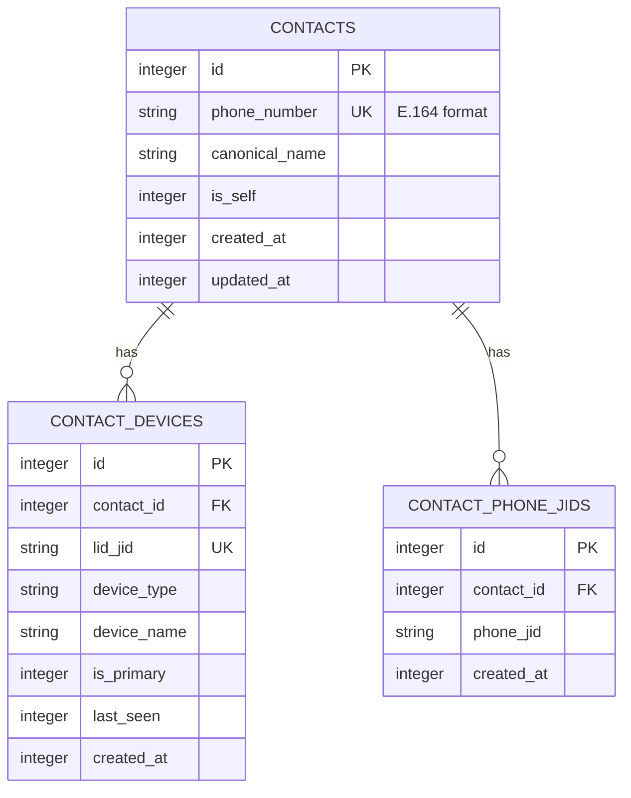

# ENHANCEMENT: Multi-Device JID Mapping Support

**Status: PROPOSED**
**Priority: High**
**Created: 2026-04-05**

---

## Problem Statement

WhatsApp's multi-device architecture allows one phone number to be linked to multiple devices (phone, desktop, web, etc.). Each device gets its own LID (Local ID) in the format `XXXXXXXXXX@lid`. The current mapping architecture assumes a **1:1 relationship** between phone numbers and LIDs, which causes:

1. **Duplicate contacts appearing** - Messages from different devices of the same user appear as separate contacts
2. **Lost device context** - Secondary device LIDs are overwritten or ignored
3. **Approval routing issues** - Approvals sent to one device LID may not match responses from another
4. **Inconsistent message grouping** - Chat history is fragmented across multiple JIDs

### Observed Behavior

From user testing:

| JID | Actual Identity | Current Behavior |
|-----|-----------------|------------------|
| `128819088347371@lid` | Benjamin (device 1) | Mapped correctly |
| `138053771370743@lid` | Benjamin (device 2) | Appears as separate contact |
| `14384083030@s.whatsapp.net` | Benjamin (phone) | Separate contact entry |

All three JIDs belong to the **same person**, but are stored as three separate contacts.

---

## Current Architecture

### Schema

```sql
CREATE TABLE IF NOT EXISTS contact_mappings (
  id INTEGER PRIMARY KEY AUTOINCREMENT,
  lid_jid TEXT NOT NULL UNIQUE,  -- Problem: Only one LID per entry
  phone_jid TEXT,
  phone_number TEXT,
  contact_name TEXT,
  created_at INTEGER DEFAULT (unixepoch()),
  updated_at INTEGER DEFAULT (unixepoch())
);

CREATE INDEX IF NOT EXISTS idx_contact_mappings_phone
ON contact_mappings(phone_number);

CREATE INDEX IF NOT EXISTS idx_contact_mappings_phone_jid
ON contact_mappings(phone_jid);
```

### Key Functions

```typescript
// src/whatsapp/store.ts

// Only stores ONE LID per contact
public upsertContactMapping (
  lidJid: string,
  phoneJid?: string | null,
  phoneNumber?: string | null,
  contactName?: string | null
): void

// Returns only ONE LID
public getUnifiedJid (jid: string): string
```

### Migration Logic

```typescript
// src/whatsapp/store.ts - migrateDuplicateChats()

// Takes ONLY the first LID found
const lidChat = chats.find((c) => c.jid.endsWith('@lid')); // ← Loses other devices
```

---

## Proposed Architecture

### New Schema

```sql
-- Primary identity: the phone number
CREATE TABLE IF NOT EXISTS contacts (
  id INTEGER PRIMARY KEY AUTOINCREMENT,
  phone_number TEXT NOT NULL UNIQUE,  -- E.164 format: +14384083030
  canonical_name TEXT,                 -- Primary display name
  is_self INTEGER DEFAULT 0,           -- Is this the MCP user's own account?
  created_at INTEGER DEFAULT (unixepoch()),
  updated_at INTEGER DEFAULT (unixepoch())
);

-- Device LIDs linked to contacts (1:N relationship)
CREATE TABLE IF NOT EXISTS contact_devices (
  id INTEGER PRIMARY KEY AUTOINCREMENT,
  contact_id INTEGER NOT NULL,
  lid_jid TEXT NOT NULL UNIQUE,        -- Each device LID is unique
  device_type TEXT,                    -- 'phone', 'desktop', 'web', 'unknown'
  device_name TEXT,                     -- Optional: "MacBook Pro", "Office Desktop"
  is_primary INTEGER DEFAULT 0,        -- Primary device for this contact
  last_seen INTEGER,                    -- Timestamp of last activity
  created_at INTEGER DEFAULT (unixepoch()),
  FOREIGN KEY (contact_id) REFERENCES contacts(id) ON DELETE CASCADE
);

CREATE INDEX IF NOT EXISTS idx_contact_devices_lid
ON contact_devices(lid_jid);

CREATE INDEX IF NOT EXISTS idx_contact_devices_contact
ON contact_devices(contact_id);

-- Legacy phone JID format (usually just one per contact)
CREATE TABLE IF NOT EXISTS contact_phone_jids (
  id INTEGER PRIMARY KEY AUTOINCREMENT,
  contact_id INTEGER NOT NULL,
  phone_jid TEXT NOT NULL,             -- e.g., "14384083030@s.whatsapp.net"
  created_at INTEGER DEFAULT (unixepoch()),
  FOREIGN KEY (contact_id) REFERENCES contacts(id) ON DELETE CASCADE
);

CREATE INDEX IF NOT EXISTS idx_contact_phone_jids_jid
ON contact_phone_jids(phone_jid);

-- Preserve existing data during migration
CREATE TABLE IF NOT EXISTS contact_mappings_backup AS
SELECT * FROM contact_mappings;
```

### Data Model



### New Store Methods

```typescript
// src/whatsapp/store.ts

export interface Contact {
  id: number;
  phoneNumber: string;
  canonicalName: string | null;
  isSelf: boolean;
  devices: ContactDevice[];
  phoneJids: string[];
}

export interface ContactDevice {
  id: number;
  lidJid: string;
  deviceType: 'phone' | 'desktop' | 'web' | 'unknown';
  deviceName: string | null;
  isPrimary: boolean;
  lastSeen: number | null;
}

// New methods

/**
 * Get or create a contact by phone number.
 * Creates the contact if it doesn't exist.
 */
public getOrCreateContactByPhone (phoneNumber: string, name?: string): Contact

/**
 * Add a device LID to an existing contact.
 * If contact doesn't exist, creates it.
 */
public addDeviceLid (phoneNumber: string, lidJid: string, options?: {
  deviceType?: 'phone' | 'desktop' | 'web' | 'unknown';
  deviceName?: string;
  isPrimary?: boolean;
}): ContactDevice

/**
 * Find contact by any associated JID (LID or phone JID).
 * Returns all devices and phone JIDs for unified display.
 */
public getContactByJid (jid: string): Contact | null

/**
 * Get all devices for a contact.
 */
public getContactDevices (contactId: number): ContactDevice[]

/**
 * Get canonical/primary JID for a contact.
 * Returns primary device LID, or first LID, or phone JID.
 */
public getCanonicalJid (jid: string): string

/**
 * Get all JIDs associated with a contact (for message retrieval).
 */
public getAllJidsForContact (phoneNumber: string): string[]

/**
 * Set primary device for a contact.
 */
public setPrimaryDevice (lidJid: string): void

/**
 * Detect device type from JID patterns or message metadata.
 */
private detectDeviceType (lidJid: string, metadata?: any): 'phone' | 'desktop' | 'web' | 'unknown'
```

### Enhanced JID Utilities

```typescript
// src/utils/jid-utils.ts

/**
 * Check if two JIDs belong to the same contact.
 */
export function areJidsFromSameContact (
  jid1: string,
  jid2: string,
  store: MessageStore
): Promise<boolean>

/**
 * Get all JIDs for a contact (merges devices).
 */
export async function getAllRelatedJids (
  jid: string,
  store: MessageStore
): Promise<string[]>

/**
 * Find the best JID for sending a message.
 * Prefers: primary device > most recent device > phone JID
 */
export async function getBestJidForSending (
  phoneNumber: string,
  store: MessageStore
): Promise<string | null>
```

---

## Migration Strategy

### Phase 1: Schema Migration (Safe, Additive)

Create new tables without removing old ones. Keep `contact_mappings` as backup.

```typescript
// src/whatsapp/store.ts - Add new method

public migrateToMultiDevice (): {
  contactsCreated: number;
  devicesMigrated: number;
  errors: string[];
} {
  const results = { contactsCreated: 0, devicesMigrated: 0, errors: [] };

  // Backup existing data
  this.db!.exec(`
    CREATE TABLE IF NOT EXISTS contact_mappings_backup AS
    SELECT * FROM contact_mappings
  `);

  // Create new schema
  this._migrateToMultiDeviceSchema();

  // Migrate existing mappings
  const existingMappings = this.db!.prepare('SELECT * FROM contact_mappings').all() as ContactMapping[];

  for (const mapping of existingMappings) {
    try {
      // Find or create contact by phone number
      let contactId = this._getContactIdByPhone(mapping.phone_number);

      if (!contactId) {
        contactId = this._createContact(mapping.phone_number, mapping.contact_name);
        results.contactsCreated++;
      }

      // Add LID devices
      if (mapping.lid_jid) {
        this._addDeviceToContact(contactId, mapping.lid_jid);
        results.devicesMigrated++;
      }

      // Add phone JID
      if (mapping.phone_jid) {
        this._addPhoneJidToContact(contactId, mapping.phone_jid);
      }
    } catch (err) {
      results.errors.push(`Failed to migrate ${mapping.lid_jid}: ${err.message}`);
    }
  }

  return results;
}
```

### Phase 2: Device Discovery

When messages arrive with new LIDs, detect and link them:

```typescript
// src/whatsapp/client.ts - In _persistMessage()

// After extracting sender/pushName, check for device linking
if (senderJid && senderJid.endsWith('@lid')) {
  // Try to link this LID to existing contact
  const existingContact = this.messageStore.getContactByJid(senderJid);

  if (existingContact) {
    // Known contact - add this device if not already tracked
    this.messageStore.addDeviceLid(
      existingContact.phoneNumber,
      senderJid,
      { deviceType: this._detectDeviceType(senderJid) }
    );
  } else if (pushName) {
    // New contact with name - create with this LID
    // Will be linked when phone JID is discovered
    this.messageStore.addDeviceLid(senderJid, senderJid);
  }
}

// Also check for phone JID in message metadata
if (senderPhoneJid && senderPhoneJid.endsWith('@s.whatsapp.net')) {
  const phone = extractPhoneNumber(senderPhoneJid);
  if (phone) {
    const contact = this.messageStore.getOrCreateContactByPhone(phone, pushName);
    // Link any LIDs with same pushName
    this.messageStore.linkSameNameLidsToContact(phone, pushName);
  }
}
```

### Phase 3: Backfill from History

Scan existing messages to discover device relationships:

```typescript
// New tool: backfill_device_mappings

public async backfillDeviceMappings (): Promise<{
  scanned: number;
  linked: number;
  newContacts: number;
}> {
  // For each unique sender_jid with a pushName, look for same-name entries
  // with different JID formats and link them
}
```

---

## Tool Updates

### Updated: `resolveRecipient` (fuzzy-match.ts)

```typescript
// Before: Returns single JID
export function resolveRecipient (
  recipient: string,
  chats: ChatInfo[]
): { resolved: string; candidates: ChatInfo[]; error?: string }

// After: Returns all related JIDs for unified matching
export function resolveRecipient (
  recipient: string,
  chats: ChatInfo[],
  store?: MessageStore  // Optional, for device lookup
): Promise<{
  resolved: string;           // Primary JID
  allJids: string[];          // All related JIDs
  phoneNumber?: string;       // E.164 phone number
  candidates: ChatInfo[];
  error?: string;
}>
```

### Updated: `send_message` (messaging.ts)

```typescript
// When sending to a contact, prefer primary/active device JID
const jid = await getBestJidForSending(phoneNumber, store);
```

### Updated: `list_chats` (chats.ts)

```typescript
// Merge duplicate chats under unified contact
const unifiedChats = store.getAllChatsUnified({ mergeDevices: true });
```

### Updated: `search_contacts` (contacts.ts)

```typescript
// Return all devices for a contact
const contact = store.getContactByJid(jid);
return {
  name: contact.canonicalName,
  phoneNumber: contact.phoneNumber,
  devices: contact.devices.map(d => ({
    lidJid: d.lidJid,
    deviceType: d.deviceType,
    isPrimary: d.isPrimary
  })),
  chats: store.getContactChats(contact.phoneNumber)
};
```

---

## API Changes

### New Response Format for Contact Queries

```json
{
  "name": "Benjamin Alloul",
  "phoneNumber": "+14384083030",
  "devices": [
    {
      "lidJid": "128819088347371@lid",
      "deviceType": "desktop",
      "deviceName": null,
      "isPrimary": true,
      "lastSeen": 1743798000
    },
    {
      "lidJid": "138053771370743@lid",
      "deviceType": "web",
      "deviceName": null,
      "isPrimary": false,
      "lastSeen": 1743795000
    }
  ],
  "phoneJid": "14384083030@s.whatsapp.net",
  "chats": [
    {
      "jid": "120363425651110648@g.us",
      "name": "WhatsAppMCP",
      "lastMessage": "..."
    }
  ]
}
```

---

## Detection Heuristics

### Device Type Detection

```typescript
// LID patterns observed:
// - Phone devices often have shorter numeric sequences
// - Desktop apps may have specific patterns
// - Web clients may have different patterns

// Heuristics to explore:
// 1. When message arrives, check if from same pushName but different LID
// 2. Check message timestamps for same-name, different-device activity
// 3. Presence/show notifications often contain device type
// 4. Group participant lists may show device metadata

function inferDeviceType (lidJid: string, context: {
  hasOtherDevices: boolean;
  messageFrequency: number;
  lastActiveHour: number;
}): 'phone' | 'desktop' | 'web' | 'unknown' {
  // Can be enhanced with ML or pattern matching
  return 'unknown';
}
```

### Self-Account Detection

```typescript
// Detect if a LID belongs to the MCP user's own account
// by checking if messages have isFromMe flag

function markSelfAccount (lidJid: string, store: MessageStore): void {
  const messages = store.listMessages({ chatJid: lidJid, limit: 5 });
  const hasFromMeMessages = messages.some(m => m.is_from_me === 1);

  if (hasFromMeMessages) {
    // This LID is one of our own devices
    const contact = store.getContactByJid(lidJid);
    if (contact) {
      store.markContactAsSelf(contact.id);
    }
  }
}
```

---

## Testing Plan

### Unit Tests

```typescript
// test/unit/multi-device-mapping.test.ts

describe('Multi-Device JID Mapping', () => {
  test('creates contact with multiple devices', () => {
    // Add phone number
    // Add multiple LIDs
    // Verify all linked correctly
  });

  test('retrieves all devices for a contact', () => {
    // Get contact by any JID
    // Verify all devices returned
  });

  test('merges messages from multiple devices', () => {
    // Create messages from different LIDs
    // Verify unified chat history
  });

  test('falls back gracefully for unknown LIDs', () => {
    // Query unknown LID
    // Verify returns single-device contact
  });

  test('migrates existing single-device mappings', () => {
    // Create legacy mapping
    // Run migration
    // Verify new schema populated correctly
  });
});
```

### Integration Tests

```typescript
// test/integration/multi-device-flow.test.ts

describe('Multi-Device Message Flow', () => {
  test('approvals work across devices', async () => {
    // Send approval to device 1 LID
    // Receive response from device 2 LID
    // Verify approval matched correctly
  });

  test('chat history unifies devices', async () => {
    // Send messages from multiple devices
    // Query chat history
    // Verify single unified conversation
  });
});
```

---

## Rollout Plan

### Phase 1: Safe Schema Addition (Week 1)

1. Add new tables without removing old ones
2. Implement parallel write to both old and new schema
3. Deploy and monitor for issues
4. No breaking changes to existing functionality

### Phase 2: Device Discovery (Week 2)

1. Implement automatic device detection
2. Add new store methods
3. Update `migrateDuplicateChats` to use new schema
4. Enable backfill tool

### Phase 3: Unified Views (Week 3)

1. Update `list_chats` to merge device contacts
2. Update `search_contacts` to show all devices
3. Update message grouping to unify devices
4. Add `--merge-devices` flag for backward compatibility

### Phase 4: Cleanup (Week 4)

1. Remove old `contact_mappings` table after migration
2. Update all queries to use new schema
3. Add comprehensive tests
4. Update documentation

---

## Files to Modify

| File | Changes |
|------|---------|
| `src/whatsapp/store.ts` | Add new schema, methods, migration |
| `src/whatsapp/client.ts` | Update `_persistMessage()` for device detection |
| `src/utils/jid-utils.ts` | Add multi-device utility functions |
| `src/utils/fuzzy-match.ts` | Update `resolveRecipient()` |
| `src/tools/contacts.ts` | Update contact queries for multi-device |
| `src/tools/chats.ts` | Update chat listing for device merging |
| `src/tools/messaging.ts` | Update send for best-JID selection |
| `test/unit/multi-device-mapping.test.ts` | New test file |
| `test/integration/multi-device-flow.test.ts` | New test file |

---

## Backward Compatibility

- Old `contact_mappings` table retained as backup
- `migrateDuplicateChats()` continues to work during transition
- `getContactMappingByLid()` deprecated but still functional
- New `getContactByJid()` supersedes old methods
- API responses add new `devices` array without breaking existing fields

---

## Open Questions

1. **Device type detection**: How can we reliably determine if a LID is for phone, desktop, or web?
   - Option A: Use message metadata patterns
   - Option B: Ask user to specify via tool
   - Option C: Infer from activity patterns

2. **Primary device selection**: Which LID should be preferred for sending?
   - Most recent activity?
   - Explicitly marked primary?
   - Phone device over others?

3. **Self-account handling**: How to handle the MCP user's own devices?
   - Store separately?
   - Mark as `isSelf` in contacts table?
   - Exclude from contact queries?

4. **Group participant mapping**: Should group participants also be deduplicated by device?

---

## References

- [BUG-group-chatjid-name-mismatch.md](../bugs/BUG-group-chatjid-name-mismatch.md) - Related JID parsing issue
- [BUG-self-account-messages-not-received.md](../bugs/BUG-self-account-messages-not-received.md) - Self-account message handling
- WhatsApp Multi-Device Protocol documentation (external)

---

## Success Metrics

| Metric | Current | Target |
|--------|---------|--------|
| Duplicate contacts for same user | Common | Rare/None |
| Approval matching across devices | Fails | Works |
| Unified chat history | Fragmented | Merged |
| Device discovery | Manual | Automatic |
| Migration coverage | N/A | 100% |