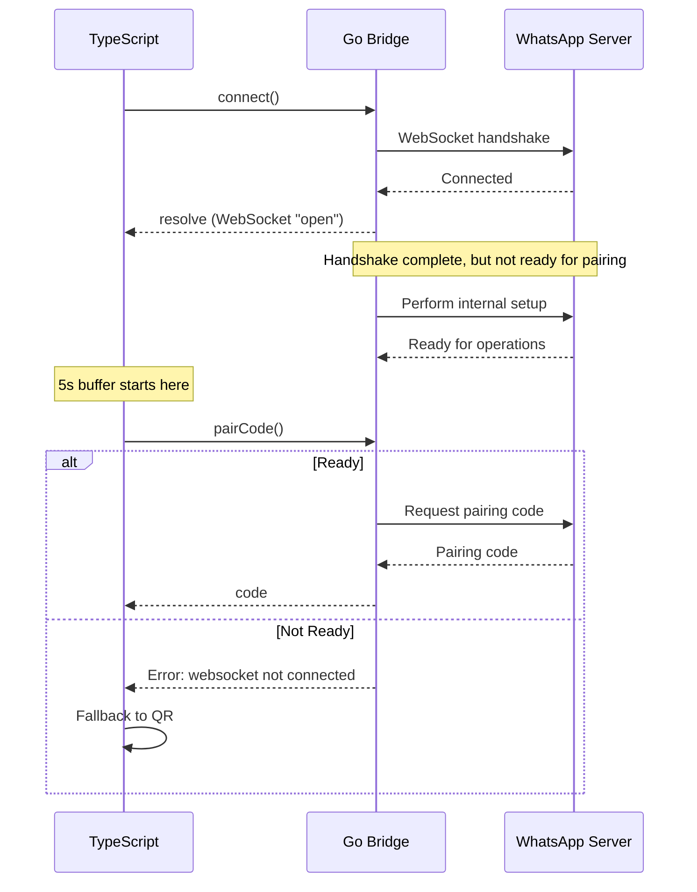

# Enhancement: Pairing Code WebSocket Connection Timing

**Status: DRAFT**
**Priority: Medium**
**Complexity: Low-Medium**
**Affected Components: `src/whatsapp/client.ts`, `src/tools/auth.ts`**

---

## Executive Summary

The WhatsApp authentication flow frequently falls back from pairing code to QR code due to a race condition between WebSocket connection establishment and the `pairCode()` call. This enhancement proposes improvements to increase pairing code success rate and provide better user experience.

---

## Background

### Current Behavior

When a user calls `authenticate`:

```typescript
// client.ts:1136-1144
if (!this._connectCalled) {
  console.error('[WA] Connection not yet initiated — connecting for authentication...');
  await this._connectWithRetry();
  this._connectCalled = true;
  console.error('[WA] WebSocket connect() completed');
  await new Promise((r) => setTimeout(r, 5000));  // 5-second buffer
}

// ... 5-second wait ...

const code = await this.client!.pairCode(digits);  // May fail here
```

### Common Log Sequence

```
[WA] Connection not yet initiated — connecting for authentication...
[WA] WebSocket connect() completed
[WA] Requesting pairing code for 14384083030
[WA] Pairing code failed (websocket not connected), switching to QR code mode
[WA] Switched to QR code mode — waiting for QR code...
[WA] QR code available — scan with WhatsApp > Linked Devices > Link a Device
```

### Why This Happens

The underlying `@whatsmeow-node/whatsmeow-node` Go bridge has multiple async steps:



The "websocket not connected" error is misleading — the WebSocket **is** connected, but the Go bridge's internal state isn't ready to accept `pairCode()` calls.

---

## Docker/MCP Toolkit Architecture Impact

Running in Docker with MCP Toolkit architecture significantly contributes to WebSocket timing issues. The 5-second buffer designed for local development is insufficient in containerized environments.

### Architecture Overview

```
┌─────────────────────────────────────────────────────────────────────────────┐
│                           Docker Host (Windows/Mac/Linux)                    │
│  ┌───────────────────────────────────────────────────────────────────────┐  │
│  │                    Docker MCP Toolkit (Gateway)                        │  │
│  │  - Manages container lifecycle                                        │  │
│  │  - Routes tool calls via stdio (stdin/stdout)                        │  │
│  │  - May pause/resume containers based on usage                        │  │
│  │  - Timeout enforcement on tool calls (~60s default)                   │  │
│  └────────────────────────────┬──────────────────────────────────────────┘  │
│                               │ stdio pipe                                   │
│  ┌────────────────────────────▼──────────────────────────────────────────┐  │
│  │              Container: whatsapp-mcp-docker                             │  │
│  │  ┌──────────────────────────────────────────────────────────────────┐  │  │
│  │  │  Node.js MCP Server (dist/index.js)                              │  │  │
│  │  │  - Listens on stdin for tool calls                               │  │  │
│  │  │  - Responds on stdout                                             │  │  │
│  │  │  - Runs on non-root user (uid 1001)                               │  │  │
│  │  └────────────────────────┬─────────────────────────────────────────┘  │  │
│  │                           │                                              │  │
│  │  ┌────────────────────────▼─────────────────────────────────────────┐  │  │
│  │  │  WhatsAppClient (TypeScript)                                      │  │  │
│  │  │  - requestPairingCode()                                           │  │  │
│  │  │  - _connectWithRetry()                                            │  │  │
│  │  │  - 5s delay after connect()                                       │  │  │
│  │  └────────────────────────┬─────────────────────────────────────────┘  │  │
│  │                           │ JSON-RPC                                   │  │  │
│  │  ┌────────────────────────▼─────────────────────────────────────────┐  │  │
│  │  │  Go Binary: @whatsmeow-node/whatsmeow-node (via spawn)            │  │  │
│  │  │  - WebSocket client to WhatsApp servers                           │  │  │
│  │  │  - Session state management                                       │  │  │
│  │  │  - QR code / pairing code generation                              │  │  │
│  │  └────────────────────────┬─────────────────────────────────────────┘  │  │
│  └───────────────────────────┼─────────────────────────────────────────┘  │
│                              │ WebSocket to WhatsApp servers               │
└──────────────────────────────┼─────────────────────────────────────────────┘
                               │
                               ▼
                    WhatsApp Servers (Meta)
                    - web.whatsapp.com
                    - Multiple data centers globally
```

### Docker-Specific Latency Sources

| Point | Description | Impact |
|-------|-------------|--------|
| **Container cold start** | First tool call after container idle | +1-3s for filesystem I/O, memory allocation |
| **Go process spawn** | `@whatsmeow-node` spawns Go binary | +200-500ms for process creation |
| **Network virtualization** | Docker bridge network, NAT translation | +50-200ms latency on each packet |
| **DNS resolution** | Container DNS → host DNS → internet | +50-300ms depending on network |
| **TLS handshake** | WhatsApp requires TLS 1.3 | +100-300ms for TLS negotiation |
| **MCP Gateway overhead** | Gateway routes stdin → tool handler | +10-50ms per tool call |

### Container Resource Constraints

From `docker-compose.yml`:

```yaml
deploy:
  resources:
    limits:
      cpus: '1.0'
      memory: 512M
```

**Resource constraints** (512MB RAM, 1 CPU) can slow down the Go bridge under load, increasing timing variability.

### The Compound Effect

The 5-second buffer was designed for local development:

```typescript
// Local development timing:
// connect() → 200ms → pairCode() → ✅ success

// Docker MCP Toolkit timing:
// connect() → container resume (+500ms)
//          → Go binary init (+300ms)  
//          → network virtualization (+200ms)
//          → TLS handshake (+200ms)
//          → WhatsApp server latency (varies)
//          → total: +1200-2000ms BEFORE pairCode() is ready
// 5s buffer - 2s overhead = 3s margin → still risky!
```

### Why "websocket not connected" Happens More Frequently in Docker

The Go bridge (`@whatsmeow-node`) reports "websocket not connected" when:
1. The WebSocket handshake hasn't completed
2. The internal Go state machine isn't ready for `pairCode()`
3. The connection was established but not fully initialized

In Docker, this race condition is **exacerbated by**:

| Factor | Impact |
|--------|--------|
| **Non-deterministic scheduling** | Container CPU time isn't guaranteed |
| **Network stack latency** | Docker's bridge networking adds layers |
| **Resource throttling** | 512MB/1CPU limit affects event loop timing |
| **Stdio transport overhead** | MCP tool calls route through stdin/stdout pipes |
| **Cold start penalty** | Container may be idle before `authenticate` call |

---

## Root Cause Analysis

### 1. Insufficient Buffer Time

**5 seconds is often not enough** for:

- WhatsApp server latency (varies by region)
- Network conditions (mobile, VPN, corporate firewall)
- Go bridge initialization overhead
- Server load spikes

### 2. No Readiness Check

The code assumes `connect()` + 5 seconds = ready for pairing. It never verifies:

- Is the Go bridge ready?
- Has the WhatsApp handshake completed?
- Is the connection stable?

### 3. All-or-Nothing Pairing Code Attempt

If `pairCode()` fails, the code immediately falls back to QR mode. There's no retry.

---

## Proposed Enhancements

### Enhancement A: Increase Buffer Time (Low Effort)

**Location:** `src/whatsapp/client.ts:1143`

**Current:**
```typescript
await new Promise((r) => setTimeout(r, 5000));
```

**Proposed:**
```typescript
const CONNECTION_READY_DELAY_MS = parseInt(process.env.AUTH_READY_DELAY_MS || '8000', 10);
await new Promise((r) => setTimeout(r, CONNECTION_READY_DELAY_MS));
```

**Pros:**
- Simple change
- Configurable via environment variable
- Reduces fallback frequency

**Cons:**
- Makes authentication slower for users with fast connections
- Still doesn't guarantee success

---

### Enhancement B: Connection Readiness Probe (Medium Effort)

**Location:** `src/whatsapp/client.ts` — new method

**Concept:** Poll the Go bridge's readiness state before calling `pairCode()`.

```typescript
/**
 * Wait for the Go bridge to report ready for pairing operations.
 * @param timeoutMs Maximum time to wait (default 15s)
 * @returns true if ready, false if timeout
 */
async waitForBridgeReady (timeoutMs = 15000): Promise<boolean> {
  // If the client exposes an isConnected() or isLoggedIn() method,
  // poll it until ready or timeout.
  const startTime = Date.now();
  const pollIntervalMs = 500;
  
  while (Date.now() - startTime < timeoutMs) {
    try {
      // Check if client reports connected/logged in
      const ready = this.client?.isLoggedIn?.() ?? this.client?.isConnected?.() ?? false;
      if (ready) {
        return true;
      }
    } catch {
      // Method may not be available, ignore
    }
    await new Promise((r) => setTimeout(r, pollIntervalMs));
  }
  
  return false;
}
```

**Usage in `requestPairingCode()`:**

```typescript
if (!this._connectCalled) {
  await this._connectWithRetry();
  this._connectCalled = true;
  
  // Wait for bridge readiness instead of fixed delay
  const ready = await this.waitForBridgeReady(15000);
  if (!ready) {
    console.error('[WA] Bridge not ready within timeout, QR fallback may occur');
  }
}
```

**Pros:**
- Waits only as long as needed
- More reliable across network conditions
- Provides debug logging for troubleshooting

**Cons:**
- Requires `isLoggedIn()` or `isConnected()` to be reliable in the Go bridge
- Adds complexity

---

### Enhancement C: Pairing Code Retry (Medium Effort)

**Location:** `src/whatsapp/client.ts:1159-1185`

**Concept:** If first `pairCode()` fails with "websocket not connected", retry once before QR fallback.

```typescript
async requestPairingCode (phoneNumber: string): Promise<PairingCodeResult> {
  // ... connection setup code ...
  
  const digits = phoneNumber.replace(/[^0-9]/g, '');
  console.error(`[WA] Requesting pairing code for ${digits}`);
  
  // Try pairing code with retry
  const maxAttempts = 2;
  let lastError: Error | null = null;
  
  for (let attempt = 1; attempt <= maxAttempts; attempt++) {
    try {
      const code = await this.client!.pairCode(digits);
      // Success — return pairing code
      // ... waitForConnection setup ...
      return { alreadyConnected: false, code, waitForConnection };
    } catch (err) {
      lastError = err as Error;
      const msg = lastError.message;
      
      // Only retry for transient connection errors
      if (msg.includes('websocket not connected') || msg.includes('not ready')) {
        console.error(`[WA] Pairing code attempt ${attempt}/${maxAttempts} failed: ${msg}`);
        if (attempt < maxAttempts) {
          console.error('[WA] Retrying in 3 seconds...');
          await new Promise((r) => setTimeout(r, 3000));
          continue;
        }
      } else {
        // Non-retryable error, break immediately
        break;
      }
    }
  }
  
  // All retries failed — fall back to QR
  console.error(`[WA] Pairing code failed (${lastError?.message}), switching to QR code mode`);
  // ... QR fallback code ...
}
```

**Pros:**
- Handles transient timing issues
- No change to happy path
- Logs attempts for debugging

**Cons:**
- Adds latency on failure (up to 6 seconds for 2 retries with 3s delays)
- May not help if fundamental connection issue exists

---

### Enhancement D: Smart Delay with Exponential Backoff (Low-Medium Effort)

**Location:** `src/whatsapp/client.ts:1143`

**Concept:** Use a smarter delay that adapts to connection state.

```typescript
async readWaitForReady (timeoutMs = 10000): Promise<boolean> {
  // Already connected? No wait needed.
  if (this.client?.isConnected?.() ?? false) {
    return true;
  }
  
  // Wait with exponential backoff
  let delay = 500;
  const maxDelay = 2000;
  const startTime = Date.now();
  
  while (Date.now() - startTime < timeoutMs) {
    await new Promise((r) => setTimeout(r, delay));
    
    if (this.client?.isConnected?.() ?? false) {
      return true;
    }
    
    delay = Math.min(delay * 2, maxDelay);
  }
  
  return false;
}
```

---

## Recommended Implementation Order

1. **Start with Enhancement A** (buffer time increase) — Low risk, immediate improvement
2. **Add Enhancement C** (retry logic) — Handles transient failures
3. **Consider Enhancement B** (readiness probe) — If `isConnected()` is reliable

---

## Implementation Checklist

- [ ] Increase default `AUTH_READY_DELAY_MS` from 5000 to 8000
- [ ] Add environment variable override for delay
- [ ] Implement pairing code retry (max 2 attempts)
- [ ] Add debug logging for timing diagnostics
- [ ] Update error messages to be more user-friendly
- [ ] Add integration test for authentication timing

---

## Testing Plan

### Unit Tests

```typescript
// test/unit/client-pairing-timing.test.ts

describe('Pairing code timing', () => {
  it('should wait for connection ready before pairCode', async () => {
    // Mock isConnected() returning false, then true
    // Verify pairCode is only called after readiness
  });
  
  it('should retry pairing code on websocket not connected error', async () => {
    // Mock pairCode failing first attempt, succeeding second
    // Verify retry logic kicks in
  });
  
  it('should fall back to QR after max retries', async () => {
    // Mock pairCode always failing
    // Verify QR fallback triggers
  });
});
```

### Integration Tests

```typescript
// test/integration/auth-timing.test.ts

describe('Authentication timing', () => {
  it('should successfully pair with slow connection', async () => {
    // Use network simulation or delays
    // Verify pairing code succeeds
  });
  
  it('should fall back to QR on persistent failure', async () => {
    // Verify graceful degradation
  });
});
```

### Manual Testing

1. **Fast network:** Pairing code should succeed within 5-8 seconds
2. **Slow network (VPN/tunnel):** Pairing code should succeed with retry
3. **Blocked network:** QR fallback should work correctly
4. **Repeated attempts:** No accumulation of timers or resources

---

## Metrics to Track

Add logging for:

```typescript
console.error(`[AUTH] Connection ready delay: ${elapsedMs}ms`);
console.error(`[AUTH] Pairing code attempt ${attempt}/${maxAttempts}: ${success ? 'success' : 'failed'}`);
console.error(`[AUTH] Fallback to QR: ${reason}`);
```

Consider exposing metrics:

- `auth_pairing_code_success_rate`
- `auth_pairing_code_retry_count`
- `auth_qr_fallback_count`
- `auth_connection_ready_ms`

---

## Alternative Approaches Considered

### 1. Pre-connect on container startup

**Idea:** Establish WebSocket connection before `authenticate` is called.

```typescript
// In initialize() with AUTO_CONNECT_ON_STARTUP=true:
await this._connectWithRetry();
await this.waitForReady(30000);  // Pre-warm connection
```

**Rejected because:**
- Increases startup time
- Connections can still time out
- User may never authenticate

### 2. Request pairing code during connect

**Idea:** Combine `connect()` and `pairCode()` in a single operation.

**Rejected because:**
- Breaks the authentication flow abstraction
- Can't handle re-authentication cleanly

---

## Related Issues

- [BUG-qr-code-delayed-by-wait-for-link.md](../bugs/BUG-qr-code-delayed-by-wait-for-link.md)
- [BUG-auth-wait-for-link-default.md](../bugs/BUG-auth-wait-for-link-default.md)
- [BUG-qr-code-not-shown-in-cursor.md](../bugs/BUG-qr-code-not-shown-in-cursor.md)

---

## References

- [WhatsApp Web Protocol](https://github.com/sigalor/whatsapp-web-reveng) — Reverse engineering notes
- [whatsmeow Go library](https://github.com/tulir/whatsmeow) — Underlying WebSocket implementation
- [MCP Protocol Spec](https://spec.modelcontextprotocol.io) — Tool call timeout behavior

---

## Change Log

| Date | Author | Change |
|------|--------|--------|
| 2026-04-04 | Assistant | Initial draft |